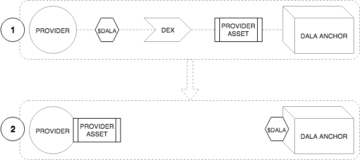
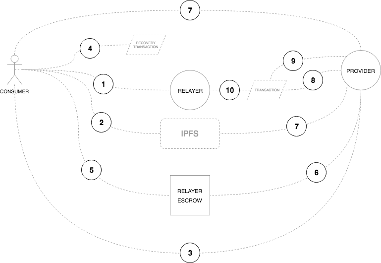
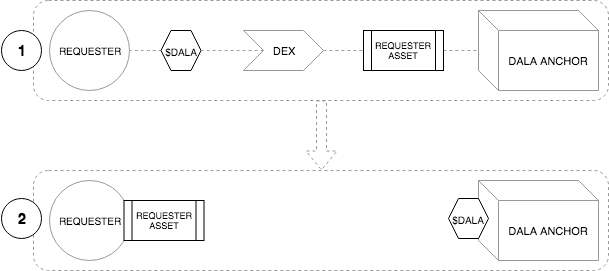
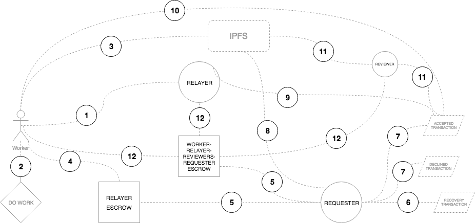

    <h1 id="dala">Dala: A decentralized financial ecosystem for emerging markets</h1>
    <h2 id="dala-abstract">Abstract</h2>

Dala is a cryptocurrency that can be used for payments of any size, nearly instantaneously, and at almost zero cost. It’s very nature of being a cryptocurrency means it is borderless, and thus facilitates remittance transactions by its very nature. But Dala is more than that. It is the cornerstone of a financial services platform that has been designed to help those in most need of it - the financially excluded. This platform is global; bridging the divide between investors and consumers; creating opportunities for philanthropists, lenders, insurers, and most importantly, the financially excluded consumers.

***

### Introduction

Dala is bringing the best protocols and blockchains together to deliver the best platform. So what are we looking for right now? Firstly, we need a reliable payments platform capable of processing millions of transactions at very low cost; and secondly, a robust, well-adopted, and turing-complete smart contracting platform. At this point in time, we have identified two public blockchains that we will build upon - Stellar for payments and Ethereum for smart contract capability.

The overriding premise of allowing $DALA to operate across chains is to ensure that the total $DALA in circulation across all active chains should never exceed the total amount of $DALA that was minted on Ethereum during the token sale in December 2017 - 1 billion tokens.

It is important to note that this space continues to evolve rapidly and we will be monitoring the environment closely. Should new blockchains or changes in existing ones indicate change is required, Dala will move towards creating the necessary swaps and contracts on the new chains. This is a public roadmap and consensus from the community would determine the future direction.

### Stellar

#### What is Stellar?

Stellar has been designed from the ground up to connect banks, payments systems, and people in order to move value quickly and reliably at almost no cost. Stellar also provides a smart contract platform that is geared heavily towards financial use cases. The Stellar network is a worldwide collection of Stellar Cores, each maintained by different people and organizations. All of these Stellar Cores - the network of nodes - eventually agree on sets of transactions. Each transaction attracts a very small fee to disincentivize bad actors on the network.

#### What is an asset on Stellar?

A Stellar asset is simply a credit from a particular account on the network. If you were to trade US dollars on Stellar, you’re not actually trading US dollars - you would be trading US dollar assets that have been credited from a particular account. It is important that there is trust in the issuer that they can redeem the credit if necessary. In Stellar, trust is represented by a trustline, simply a declaration from an account that it trusts a particular asset. Trustlines can also limit the amount of the asset that is trusted from a particular issuer.

#### $DALA on Stellar

To create the $DALA asset on Stellar, Dala will create three unique accounts: 

* Source account - this is the account of the entity that is creating the asset.
* Issuing account - this account is created by the source account to create new tokens.
* Distribution account - this account is for distributing tokens to the public.

The issuing account will create 1 billion $DALA tokens and send them to the distribution account. The issuing account will then be locked by setting all weights and thresholds to zero, making all keys invalid. This prevents the issuing account from ever creating any more transactions, preventing the creation of additional tokens. It is imperative that this initial supply matches what was originally minted on Ethereum during the initial token issuance. 

#### Stellar Distributed Exchange

The Stellar network acts as a decentralized, distributed exchange of any type of asset that has been added to the network. Accounts can make offers to buy or sell assets. The foundation will issue $DALA from Ethereum to Stellar to seed the order book and facilitate liquidity in the network, in accordance with the overall token supply schedule. The Dala control account will be the custodian of these tokens and make the requisite sell orders on the exchange. The exchange also facilitates cross-asset payments (paths of asset conversion can contain up to 6 hops) but the whole payment is atomic.

Lastly, Dala will also act as a $DALA anchor. Anchors are entities that are trusted to hold deposits and issue credits into the Stellar network for those deposits. 

#### Summary

Stellar is a reputable, public blockchain and has been created for the exact use cases that Dala is tackling. For this reason, Stellar will replace the existing off-chain scaling solution that Dala uses. This removes Dala as the primary arbitrator and facilitator of transactions on the network, moving from the current centralized exchange-type architecture to a decentralized network.

### Ethereum

#### What is Ethereum?

Ethereum is a decentralized blockchain platform that runs applications called smart contracts. These smart contracts execute exactly as programmed without any possibility of downtime, censorship, fraud, or third-party interference. This distributed global infrastructure enables developers to create new markets, store registries of debts or promises, move funds in accordance with predefined, immutable rule sets, maintain a decentralized identity, and many more things that have not been invented yet; all without middlemen or counterparty risk.

Ethereum is more than just a promise and has delivered on this time and again. This is most apparent by looking at the developer adoption:

* There is an order of magnitude more developers building on Ethereum than any other blockchain platform, and that gap is only getting wider.
* The Ethereum code school from Loom, CryptoZombies, has had over 200,000 users since November 2017 and is growing consistently by more than 30,000 per month.
* Truffle, an Ethereum development framework, has had over 500,000 downloads and is growing at over 45,000 per month.
* Developer adoption is important - generally, in order to have applications worth using, you need to attract enough developers to build them.
* Ethereum also brings the best tools and infrastructure for the development of distributed applications. As developer infrastructure grows, the more enjoyable and easier it becomes for new developers to build, and this cycle continues.

Furthermore, Ethereum does not sacrifice decentralization. In blockchain technologies, you often hear of the scalability trilemma. The scalability trilemma states that blockchain systems can only possess two of the following properties:

* Decentralization - enables censorship resistance and permits anyone to participate in the ecosystem without prejudice.
* Scalability - the ability to process transactions quickly for many, many users concurrently.
* Security - immutability of the ledger and resistance to attacks (e.g. 51%, Sybil, or DDos)

Ethereum prioritizes decentralization and security; this limits its suitability as a micropayments transaction platform (due to cost and speed) but at the same time creates a permissionless and censorship-resistant platform that can be used by anyone, for any purpose. No one can stop you uploading your smart contract or dApp and no one can stop your users from using it.

#### What is an ERC20 token?

ERC20 is a technical standard used for smart contracts on the Ethereum blockchain for implementing tokens. ERC stands for Ethereum Request for Comment, and 20 is the number that was assigned to this request. The clear majority of tokens issued on the Ethereum blockchain are ERC20 compliant.

$DALA was issued as an ERC20 token on the Ethereum blockchain at the start of the token sale in December 2017 with a fixed supply of 1 billion tokens.

***

## Toa
> Toa means *give* in Swahili.

### Atomic Swaps

The circulating supply across all supported chains will never exceed the total supply that was created during the initial token issuance event in December 2017 - 1 billion $DALA.

Token supply control can be trustlessly adhered to by using atomic swap smart contracts that control the issuance and lock-up of tokens across the supported chains. The caveat to all participating chains would be that they support custom tokens analogous to ERC20 on Ethereum, as well as smart contract capability to support atomic swaps.

#### What is an atomic swap?

An atomic swap allows for the exchange of one cryptocurrency for another cryptocurrency without the need for a trusted third party. It is paramount that this is atomic - this means that either the entire swap occurs successfully or none of it does.

Most cross-chain atomic swaps use what is called a hashed timelock contract (HTLC). In practical terms, this means that recipients of a transaction have to acknowledge payment by generating cryptographic proof within a certain timeframe. Otherwise, the transaction does not take place. This is probably easier to explain with an example using Stellar and Ethereum:

* Let’s assume Bob would like to swap 10 $DALA on Ethereum for 10 $DALA on Stellar. Mary has 10 $DALA on Stellar and would like to swap them for 10 $DALA on Ethereum. Now that we have willing participants, the swap can take place.
* First, Mary generates 32 random bytes and calls this the preimage, then computes the SHA256 hash of this preimage which is called the hashlock. The preimage is not shared by Mary until every required transaction has been set up.
* Mary generates a new Stellar keypair and calls this the swap keys. This account will act as a cryptographic escrow that holds the funds until the swap setup is complete.
* Mary then submits a Stellar transaction that does four things:

    1. Creates the swap account by sending the minimum XLM reserve balance to it;
    2. Moves 10 $DALA into the swap account;
    3. Locks the swap account with the hashlock and Bob’s public key;
    4. Removes the swap account private key as a signer;

* Bob is watching Mary’s Stellar account for the transaction and sees the new swap account, inspects the transaction, and extracts the hashlock from it.
* Bob now sends his 10 $DALA to an Ethereum smart contract which locks it with Mary’s Ethereum address as well as the hashlock.
* Mary sees this transaction and confirms that Bob’s Ethereum address, $DALA amount, and the hashlock are valid.
* Mary then claims her 10 $DALA from the Ethereum smart contract using the preimage that she generated in step one. Because this occurs on-chain, the preimage is now public knowledge.
* Bob is watching the Ethereum contract and sees that Mary has claimed the $DALA using her preimage; Bob can now use this preimage to claim the $DALA.
* Bob submits a Stellar transaction that claims the $DALA funds in the swap account using this preimage.

#### $DALA Atomic Swaps

Dala will be launching **Toa**, which encompasses the smart contracts (on both the Ethereum and Stellar blockchains) as well as a dApp.

Dala will initially only support atomic swaps between $DALA ERC20 tokens on Ethereum and $DALA assets on Stellar. $DALA assets issued by the Dala foundation on Stellar can only enter circulation when atomically swapped from Ethereum. 

### Architecture

* Toa is a dApp that facilitates the atomic swaps of $DALA between Ethereum and Stellar.
* This is achieved by using both Stellar and Ethereum light clients from the dApp - these light clients are responsible for signing the transaction payloads before being broadcast to the blockchain.

***

## Sura
> Sura means *identity* in Swahili

### Introduction

Sura is decentralized and trustless self-sovereign identity.

*Notes*
* User creates new account to manage identity
* User can *approve* an app by adding it as a signer to the account. Importantly, the signer weights need to be changed so that user weight is always *number_of_ signers + 1*
* Thresholds would have to be changed:
    * low security: *number_of_signers + 1*
    * medium and high security: *number_of_signers + 2*
* App can then make an attestation against the user using *manage data* - this transaction would have to be signed by the app and accepted by the user by them signing it too.
* To prove ownership of the identity, the user would have to create and sign a low security transaction (e.g. bump sequence).

***

## Sifa
> Sifa means *reputation* in Swahili

### Introduction

Sifa is decentralized and trustless reputation management.

***

## Soko
> Soko means *market* in Swahili.

### Introduction

Soko is a decentralized and trustless marketplace for products and services. 

### Architecture

The Soko protocol defines a procedure for defining, administering, buying, and selling products and services using a set of smart contracts and standardized interfaces. Soko has been heavily inspired in design by the 0x decentralized exchange protocol and the Dharma decentralized lending protocol.

#### End Users

The end users of Soko are the entities looking to purchase or provide services. These entities can be people, corporations, contracts, or systems and are separated into two categories:
1. **Provider -** a party in a market transaction who is providing a service or product for a pre-determined and cryptographically agreed to amount.
2. **Consumer -** a party in a marketplace transaction who is purchasing a service or product for the specified amount. 

#### Intermediaries

Intermediaries are entities who provide additional services to the protocol. There are two categories of intermediaries:
1. **Relayers -** relayers in Soko aggregate signed marketplace offers, and for an agreed fee, host the messages in a centralized marketplace and provide consumers the ability to purchase the services,. Relayers should further commit to offering the products and services with the highest reputation and have freedom to exclude services whose service delivery is questionable or non-existent based on consumer's attestations. To facilitate relayer discovery, a list of community approved relayers will be maintained on Github (similar to the [0x relayer registry](https://github.com/0xProject/0x-relayer-registry)) 
2. **Administrators -** administrators in Soko allow the registration of providers and the creation of signed marketplace offers. Administrators provide the ability for providers to capture product information, create a custom asset representing the product, and sign and store additional metadata in IPFS - the hash of which is attached to the transaction that creates the asset. Soko will provide an administrator dApp on launch. To facilitate administrator discovery, a list of community approved administrators will be maintained on Github (similar to the [0x relayer registry](https://github.com/0xProject/0x-relayer-registry)) 

#### Reputation

The reputation score is used to indicate relative reliability of consumers, providers, and relayers. Reputation votes are cryptographically signed attestations of confidence or distrust in the ability of an entity to fulfill their role as defined by the protocol.

#### Staking

Providers are required to stake $DALA before they can participate in the market. Staking takes the form of purchasing a $SOKOPROVIDER from the DEX.

### Specification

#### Overview

Soko will initially be built on the Stellar blockchain. The primary reason for this is that Soko will provide a high-throughput market and the fees should be as low as possible and the transaction speed as fast as possible to facilitate these purchases. There is a worthy sacrifice of the turing-completeness of Ethereum for the speed and cost of Stellar, especially given that the market can be easily defined as sets of atomic operations that play very well with the smart contracting capability of Stellar.

[IPFS](https://ipfs.io) will also be used extensively to store additional metadata about products that cannot be stored on-chain.

#### Register as Provider

1. To register as a provider, a provider asset ($SOKOPROVIDER) must be purchased. These assets are issued by Soko and will have a price in $DALA. Soko will offer $SOKOPROVIDER on the DEX.  
2. The provider must hold the asset at all times and this acts as a public indication that an account can provide products and has staked sufficient $DALA. 

#### Create Product

1. Providers must first create the metadata that represents the new product. This product metadata should adhere to the [product schema](https://github.com/GetDala/soko/blob/master/schemas/product.js) and provides sufficient information to describe product as well as external assets to display the product to consumers via the relayers. This metadata may also include additional service URLs to validate or verify information provided by the relayer (e.g. the number of an electricity meter).
2. The product metadata is then stored on [IPFS](https://ipfs.io) and the resultant hash is recorded.
3. The provider creates a new asset representing the product. The IPFS hash is included as the memo of the create transaction.

#### Purchase Product

1. The consumer selects the product they wish to purchase using their chosen relayer.
2. All required information is captured by the relayer as determined by the product metadata from the provider. This additional information should adhere to the [purchase schema](https://github.com/GetDala/soko/blob/master/schemas/purchase.js) and provides all the required metadata for the provider to fulfil the purchase. This information is stored on [IPFS](https://ipfs.io) and the resultant hash is recorded. 
3. The consumer requests a new address from the provider. The provider should create a new escrow account requiring the relayer and the provider as signers.
4. The consumer creates a recovery transaction:
    * Pay the consumer the funds they paid for the goods.
    * Have a time lock (default 24 hours from purchase).
    * Merge account to provider account so that they get their Lumens back.
    * This transaction must be signed by the relayer and the provider. 
    * The signed transaction is then stored by the consumer for future use should they not receive their purchased goods or a refund within the lock up time.
5. When the signed recovery transaction has been received and stored, the consumer pays the required funds to the provider-relayer escrow account using the IPFS hash as the memo to the transaction.
4. The provider should be monitoring the transaction activity on the escrow account. The provider should interrogate the incoming transaction using the IPFS hash to retrieve the transaction metadata. It is the providers responsibility to ensure that sufficient funds have been received for the selected product.
5. The provider must deliver the product to the consumer. This is an off-chain process and can take many forms although we expect this to be mostly digital products such airtime, data, and other value added service products. The provider should store the resultant transaction proof on IPFS and record the hash.
6. Based on the state of the product delivery to the customer, the provider *must* respond accordingly.
    * If the provider transaction was successful, the provider needs to prepare a transaction that must:
        * Pay the consumer *n* product asssets (as was created [here](README.md#soko-specification-create-product)).
        * Pay the relayer the agreed upon amount.
        * Pay their own account the remaining value.
        * Add a memo that includes the IPFS hash of the proof of successful transaction.
        * Merge account to the provider account so that they get their Lumens back.
    * If the provider transaction failed, the provider needs to prepare a transaction that must:
        * Pay the consumer their funds
        * Merge the account to the provider account so that they get their Lumens back.
    * The provider may choose to do nothing, in which case the consumer may claim their funds back after the time lock has expired.
7. The provider then signs this transaction and stores the XDR in IPFS for signing by the relayer. 
8. The relayer signs the transaction if they are satisfied with the content.

#### Reviews

* Could negative review assets be sent to providers account?
* How to stop them trading?
* What about the provider asset is fungible and an offer is immediately created when the provider is created?
* Provider asset is unique per provider?
* Give this some more thought.

### Use Cases

#### Digital Products

* Airtime
* Data
* Electricity
* Rates
* Taxes
* School fees
* Parametric insurance
#### Physical Products

* Literally anything

### Attacks and Limitations

* Relayer and provider working together 
* Relayer and consumer working together
* Trustworthy provider goes rogue
* Mistakes

***

## Kazi
> Kazi means *work* in Swahili.

### Introduction

Kazi is a decentralized and trustless marketplace for microjobs. 

### Architecture

The Kazi protocol defines a procedure for defining, administering, and fulfilling microjobs using a set of smart contracts and standardized interfaces. Kazi has been heavily inspired in design by the 0x decentralized exchange protocol and the Dharma decentralized lending protocol.

#### End Users

End users of Kazi are the entities looking to have work done or fulfill work. These entities can be people, corporations, contracts, or systems and can be separated into two categories:
1. **Requester -** an entity that requires work to be completed. Requesters create job offers that are cryptographically signed and have committed sufficient budget to the escrow account for distribution to workers who fulfill the required specification.
2. **Worker -** an entity that fulfills the required work and expects to be paid the offered value on successful completion of the task. Successful completion is determined by the cryptographic verification by nominated reviewers.

#### Intermediaries

Intermediaries are entities who provide additional services to the protocol. There are three categories of intermediaries:
1. **Relayers -** relayers in Kazi aggregate signed job requests, and for an agreed fee, host the requests in a centralized marketplace and provide workers the ability to fulfill the jobs and reviewers the ability to verify the completed work. To facilitate relayer discovery, a list of community approved relayers will be maintained on Github (similar to the [0x relayer registry](https://github.com/0xProject/0x-relayer-registry))
2. **Reviewers -** a trusted entity or entities that collect market-determined fees for ensuring that workers fulfill the request that they have committed to. Reviewers may be people, contracts, or systems but commit to verifying the authenticity of a cryptographically signed confirmation from a worker that the job has been completed as requested. The nature of this verification will depend on the job and the available mechanisms for verification. Importantly, *n* reviewers may be determined necessary to ensure the release of funds from escrow to a worker.
3. **Administrators -** administrators in Kazi allow the registration of requesters and reviewers and allow the creation of signed job offers. They provide the ability for requesters to capture job information, create a custom asset representing the job, and sign and store additional metadata in IPFS - the hash of which is attached to the transaction that creates the  asset. To facilitate administrator discovery, a list of community approved administrators will be maintained on Github (similar to the [0x relayer registry](https://github.com/0xProject/0x-relayer-registry))

#### Reputation

The reputation score is used to indicate reliability and quality of requesters, workers, and reviewers. Reputation votes are cryptographically signed attestations of confidence or distrust in the ability of an entity to fulfill their role as defined by the protocol.

### Specification

#### Overview

Kazi will initially be built on the Stellar blockchain. This facilitates the fast and cheap payments necessary to reward workers and reviewers appropriately, as well as ensuring that necessary on-chain activity is affordable for all parties involved.

[IPFS](https://ipfs.io) will be used extensively to store information about jobs as well as the worker responses.

#### Register Requester

1. To register as a requester, a requester asset ($KAZIREQUESTER) must be purchased. These assets are issued by Kazi and will have a price in $DALA. Kazi will offer $KAZIREQUESTER on the DEX.
2. The requester must hold the asset at all times and this acts as a public indication that an account can request work and has staked $DALA.

#### Create Job

1. The requester creates the job definition using a reliable administrator dApp. This metadata should adhere to the [job schema](https://github.com/GetDala/kazi/blob/master/schemas/job.js) and provide sufficient information to describe the job to workers via the relayers. This metadata may include additional URLs to describe other aspects of the job being defined (e.g. image annotation will have to include the URL of the image to be annotated).
2. The job metadata is then stored on [IPFS](https://ipfs.io) and the resultant hash is recorded.
3. The requester must then create an asset that represents this job. The IPFS hash is included as the memo of the create transaction.

#### Share Job

Signed job offers need to be distributed to relayers so that they can be offered to interested workers. The actual mechanics of sharing this information is not defined by the protocol, however, the required outputs of the operation are.
1. The requester must create an escrow account with the relayer with equally weighted signing power between them. 
2. The requester will create a recovery transaction to close and merge the account. This transaction must be signed by the relayer. The requester will keep this transaction securely and it is to be used if the relayer no longer signs payment transactions or the requester would like to stop offering this job with this relayer and is a preventative measure to ensure funds are not locked up and inaccessible.
3. The requester must send sufficient funds to the escrow account (e.g. if the requester has 300 jobs at 10 $DALA each and has agreed to pay the relayer 1% fee, then the requester must send 3030 $DALA to the account).
4. The relayer is now incentivised to offer these jobs to workers on their dApp.

#### Work

1. Workers interact with relayer dApps to complete jobs. Because the fee models incentivise the relayer, the relayers with the best experience *should* win the most workers. There is limited financial incentive that can be offered to workers to use different relayers as the fee is paid by the requester, however, in order for a worker to claim a job they do need to purchase a job asset. The price of these assets is determined by the requester and can be dependent on a number of external factors relevant to the requester. In the dApp, this cost would be for the worker and can act as a kind of staking mechanism to prevent bad actors that may want to lock up all the jobs. There is definitely opportunity here for relayers to reduce these costs for the workers and is probably a race to zero.
2. Once a worker has acquired a job asset, they must complete the task as defined. 
3. When the job is complete, the worker needs to prepare the job result payload. This must adhere to the [job result schema](https://github.com/GetDala/kazi/blob/master/schemas/job-result.js) and includes the job result as an encrypted payload, and an encrypted hash to be used for signing. This must be uploaded to IPFS and the hash recorded.
4. The worker sends the job asset to the requester-relayer escrow account with the IPFS hash as a memo.
5. The requester monitors this account and when this payment is seen, creates a new escrow account with selected reviewers (reviewer selection is an opinionated process that the protocol remains agnostic of), relayer, and the worker provided hash as signers (the hash must be retrieved from IPFS).
6. The requester must create a time-locked recovery transaction to close and merge this account should sufficient approval not be received in time.
7. The requester must now create two transactions. 
    1. A *job accepted* transaction that must:
        1. Send payment to worker.
        2. Send payment to relayer.
        3. Send payment to reviewer escrow.
    2. A *job declined* transaction that must:
        1. Send payment to relayer.
        2. Send payment to reviewer escrow.
        3. Close and merge account to requester.
8. These transactions should be signed by the requester and stored on IPFS.
9. The relayer needs to be made aware of these transactions. The relayer will confirm the transactions are correct and sign them. The *job accepted* transaction will be shared with the worker.
9. The worker must now sign the job using the preimage that was used to encrypt the payload in step 3. This is now public and reviewers and requester will now have access to the secret used to encrypt the payload.
10. The newly signed transaction is now broadcast to the reviewers along with the *job declined* transaction. They now have the ability to check the result of the job and if they approve of the content, can sign the *job accepted* transaction; if they don't then they can sign the *job declined* transaction.
11. When a sufficient threshold has been reached, the transaction is broadcast on-chain and all parties receive payment. The *job accepted* and *job declined* transactions will have the same sequence number, so only one can be executed. These thresholds will be determined by the requester and the first one that is reached will be the successful one.
    
### Use Cases

* Surveys
* Image annotation and classification
* Secret shopper
* Information Gathering
* SEO research

### Attacks and Limitations

* Requester and reviewers working together
* Worker and reviewers working together

***

## Kopa

> Kazi means *loan* in Swahili.

### Introduction

Kopa is a [Dharma Protocol](https://dharma.io) relayer dApp. Kopa will aggregate signed debt order messages in a centralized order book to provide retail investors the ability to invest in the debt order by filling the signed debt orders. Creditors can browse through the signed debt order messages and trustlessly issue themselves debt tokens in exchange for the requested principal.

Dala’s launch partner, Wala, will act as an underwriter to allow the creation of signed debt orders by their users. In the Dharma Protocol, an underwriter is a trusted entity that collects market-determined fees for performing the following functions:

* Originating a debt order from a borrower
* Determining and negotiating the terms of the debt
* Cryptographically committing to the likelihood they ascribe to that debt relationship ending in default
* Administering the debt order’s funding by forwarding to relayers
* Servicing the debt
* In the case of defaults or delinquencies, collecting on collateral or assets via legal mechanisms and passing collected proceeds to investors.

Importantly, users will be able to settle necessary payments for debt orders using a Stellar address and Dala federation. This is important as the users wallets can operate on the most optimum chain for their use-case (in Wala’s situation, this will be Stellar), but still be able to settle the necessary payments on the Ethereum blockchain.

For more information, see the Dharma Protocol white paper at https://whitepaper.dharma.io

***